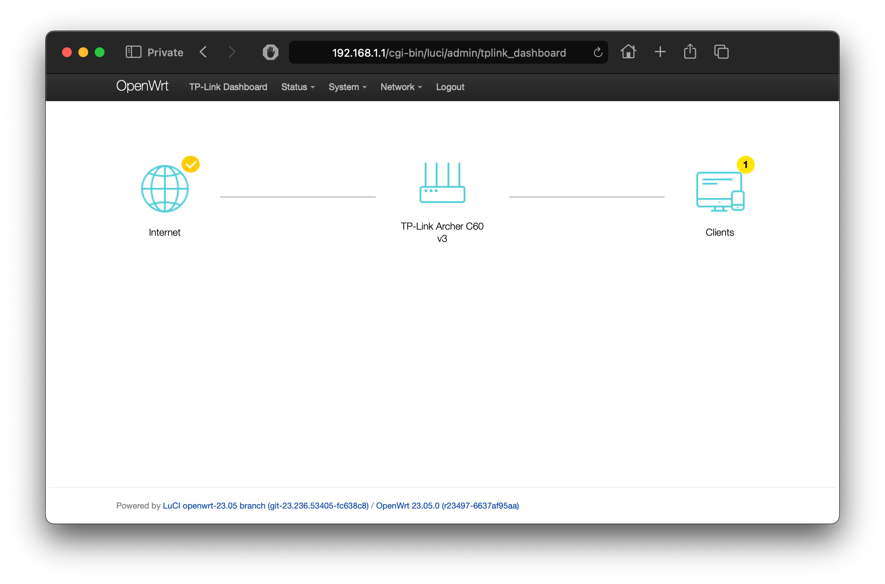
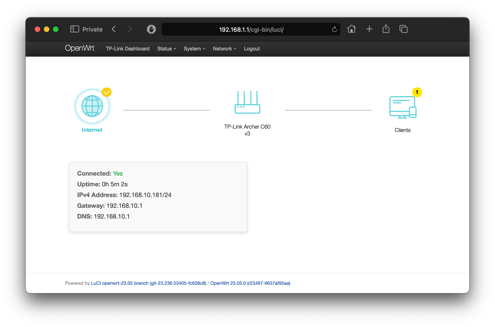
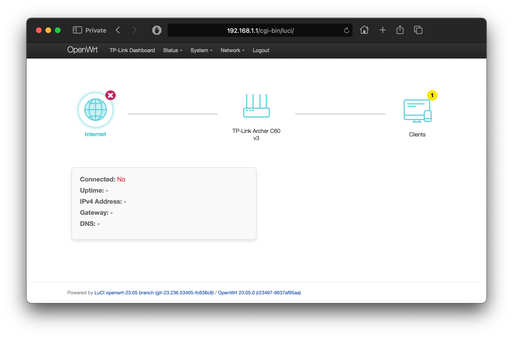
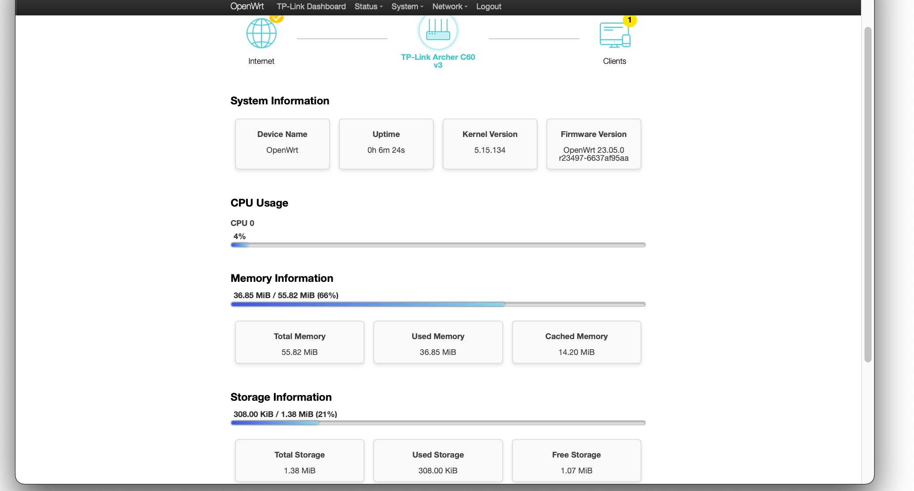
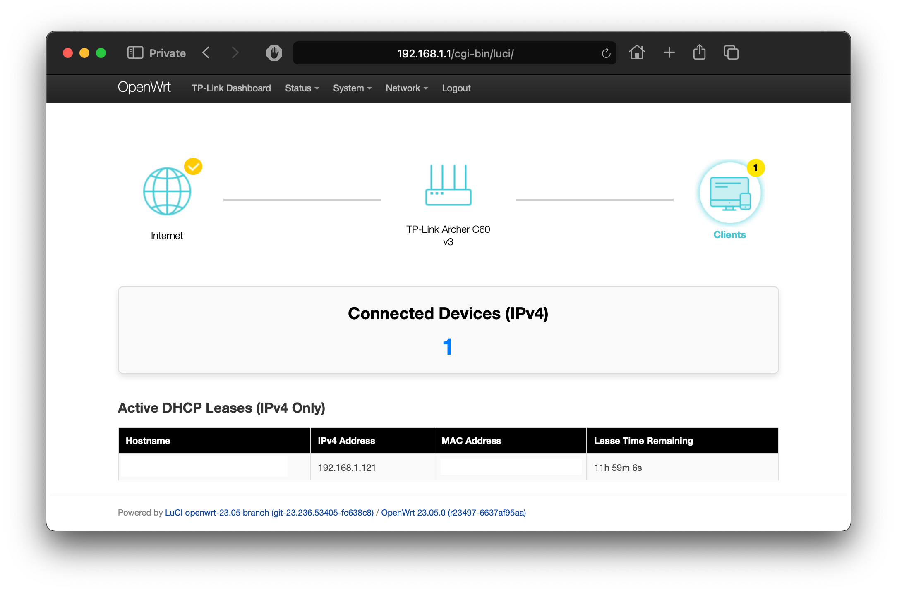

# luci-mod-tplink_dashboard
A custom LuCI module for OpenWrt providing a dynamic and visually engaging dashboard inspired by TP-Link firmware. This project is designed to replicate and showcase features commonly found in TP-Link router dashboards, bringing a modern and user-friendly experience to OpenWrt users.


## Overview

`luci-mod-tplink_dashboard` was created to replicate the look and functionality of TP-Link firmware dashboards while leveraging the flexibility and openness of OpenWrt. The design aims to provide essential router metrics in an intuitive interface, such as real-time CPU usage, device statistics, DHCP client details, and Internet connection status.

This project was developed with inspiration and components from the following OpenWrt projects:
- [luci-mod-dashboard](https://github.com/openwrt/luci/tree/master/modules/luci-mod-dashboard)
- [luci-app-cpu-status-mini](https://github.com/gSpotx2f/luci-app-cpu-status-mini)
---
### Credits
This project was developed with the assistance of **ChatGPT**, which provided guidance in coding, design, and implementation. The codebase also includes concepts and functionality adapted from the above-mentioned projects.

---

## Features

1. **TP-Link Dashboard Mod**:
   - A custom dashboard interface designed to replicate the aesthetics and functionality of TP-Link firmware.
   - Intuitive icons and layout for essential router metrics.

2. **Dynamic Dashboard Icons**:
   - Icons for Internet connectivity, device detail, and DHCP clients.
   - Updates in real-time using polling mechanisms.

3. **Custom Styling**:
   - Includes polished icons and custom CSS to provide a professional TP-Link-like appearance.

---

## Screenshots

### Dashboard Overview


### Internet Status - Connected


### Internet Status - Not Connected


### Device Info 


### Connected Clients 


---

## Getting Started

> **Note:** The module is tested on **OpenWrt v23.05.0**


### Installation
--- **Using OpenWrt image builder**
1. Clone the repository:
   ```bash
   git clone https://github.com/tp82d1/luci-mod-tplink_dashboard.git
2. Move it to `package` folder. 
3. Enable `luci-mod-tplink_dashboard` in make menuconfig and save it
>`LuCI > 2. Modules > luci-mod-tplink_dashboard`
4. Build the package:
```bash 
make package/luci-mod-tplink_dashboard/compile V=s  
```
\
--- **Using .ipk file in the router**

```bash
wget --no-check-certificate -O /tmp/luci-mod-tplink_dashboard_1.0.0-r4_all.ipk https://github.com/tp82d1/luci-mod-tplink_dashboard/releases/download/files/luci-mod-tplink_dashboard_1.0.0-r4_all.ipk
opkg install /tmp/luci-mod-tplink_dashboard_1.0.0-r4_all.ipk
rm /tmp/luci-mod-tplink_dashboard_1.0.0-r4_all.ipk
/etc/init.d/rpcd reload
/etc/init.d/uhttpd restart
```

# Directory Structure
```bash
 luci-mod-tplink_dashboard/ 
├── Makefile
├── htdocs
│   └── luci-static
│       └── resources
│           └── view
│               └── tplink_dashboard
│                   ├── css
│                   │   └── custom.css
│                   ├── icons
│                   │   ├── devices.png
│                   │   ├── devices_active.png
│                   │   ├── dhcp.png
│                   │   ├── dhcp_active.png
│                   │   ├── internet.png
│                   │   ├── internet_active.png
│                   │   ├── no.png
│                   │   └── yes.png
│                   ├── include
│                   │   ├── d_devices.js
│                   │   ├── d_dhcp.js
│                   │   └── d_internet.js
│                   └── index.js
└── root
    └── usr
        └── share
            ├── luci
            │   └── menu.d
            │       └── luci-mod-tplink_dashboard.json
            └── rpcd
                └── acl.d
                    └── luci-mod-tplink_dashboard.json
```

